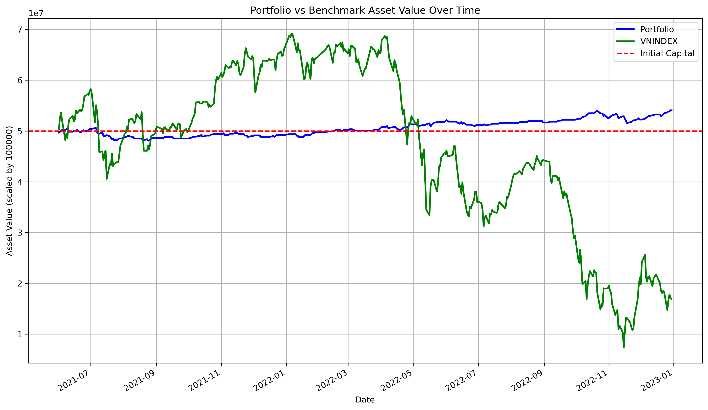
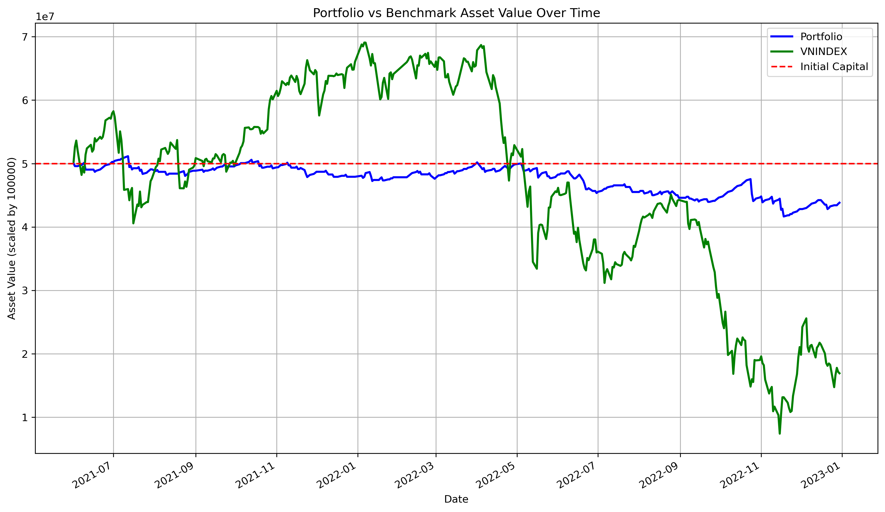
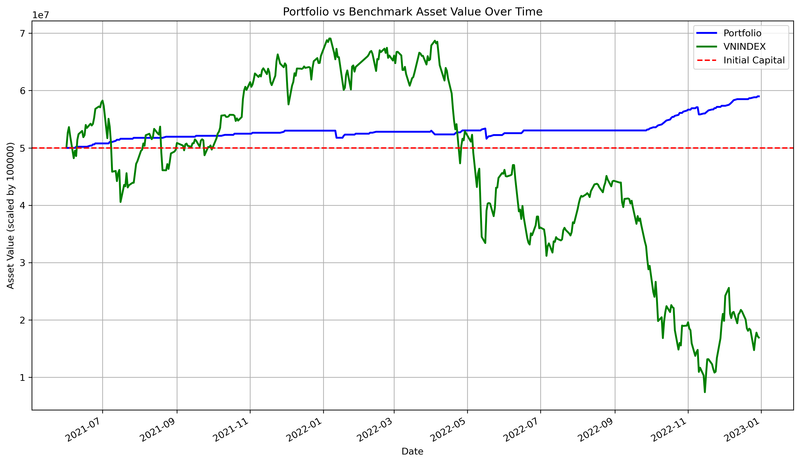
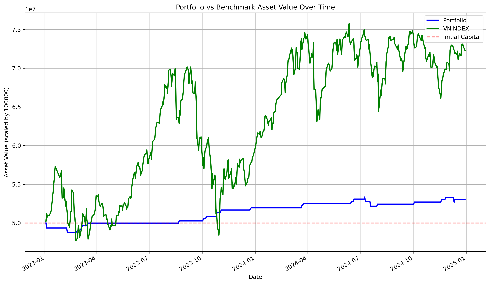
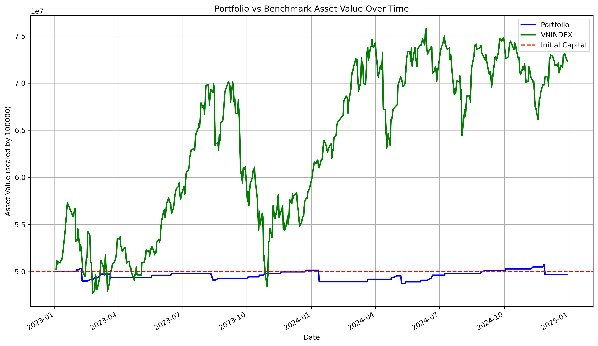

# Abstract

---

This project explores potential intraday trading signals in the VN30F1M market using the Opening Range Breakout (ORB) and Volume Weighted Average Price (VWAP) Trend strategies, which both analyze the first opening candle within a fixed time window. Following a structured Nine-Step framework, we test the strategy through data collection, backtesting, and optimization to assess its performance using key metrics like profit factor and Sharpe ratio. The results provide insights into the strategy's effectiveness, offering a systematic approach to intraday trading.

# Introduction

---

This project tries to test whether a fixed time window from the beginning of VN30F1M market can generates signal for a profitable intraday strategy. 

**Feature**

- [x] Generate Mock Data for unit testing
- [x] Validate Test Case: Financial, Technical Signal and Backtesting
- [x] Optimize hyperparameters
- [x] Evaluate backtesting and optimization
- [ ] Paper trade

**Installation**

- Requirement: pip
- Create and source new virtual environment in the current working directory with command
```
python3 -m virtualenv venv
source venv/bin/activate
```
- Install dependencies by: 
```
pip install -r requirements.txt
```

# Related Work
Over the years, the n-minute ORB, with variants including 5-minute, 15-minute, 30-minute and 60-minute time frames has been considered by many techinical traders. My project is motivated by two papers [1] and [2]. 

# Trading (Algorithm) Hypotheses
The first fixed time window of VN30F1M market could predict the next trend of market.  

# Data
I use the tick data including datetime, matched price and matched volume of VN30F1M from 2021-06-01 to 2024-12-31. In particular, the In-sample data is from 2021-06-01 to 2022-12-31 and Out-of-Sample data is from 2023-01-01 to 2024-12-31.
## Data Collection
- Create .env file and enter your data source configuration with the format
```
HOST=<host or ip>
PORT=<port>
DATABASE=<database name>
USER=<username>
PASSWORD=<password>
REDIS_HOST=<host or ip>
REDIS_PORT=<port>
REDIS_PASSWORD=<password>
```
- Run the Python file run_data_collection.py with the following command: 
```
python run_data_collection.py
``` 
- After running this command, the tick data is stored under csv files in the `trading-data` folder. 

## Data Processing
The Data after fetched and processed in class **DataService**. In particular, the price and volume is changed to Float. 

# Implementation
- I have implemented two strategies called ORB and VWAP trend in two files `./src/strategy/ORB.py` and  `./src/strategy/VWAP.py`, respectively. These two strategies both used a fixed n-minute ORB to analyze and generate signal for the next candle.  

# In-sample Backtesting
- To print the In-sample Backtesting result of ORB strategy, run the `run_backtesting.py` file with the following command: 
```
python run_backtesting.py -m 0 -s ORB -p 0
```
where -m means we use the In-sample data, -s means we use strategy ORB and -p means we use the initial parameters. 
- Similarly, to print the results of VWAP strategy, we change the value of -s to VWAP as follow: 
```
python run_backtesting.py -m 0 -s VWAP -p 0
```
## In-sample Backtesting Result
- The console will display the result of VNINDEX as benchmark within that period, following by the result of my strategy. 
- The following table display the Sharpe Ratio and final return of VNINDEX, ORB and VWAP strategies:
 
|               | Sharpe Ratio | Maximum Drawdown | Annual Return |
|---------------|--------------|------------------|---------------|
| ORB strategy  | -1.03        | 18.588%          | -7.90%        |
| VWAP strategy | 0.4          | 4.888%           | 5.01%         |
| VNINDEX       | -0.26        | 67.91%           | -12.11%       |

- Asset plot of the VWAP strategy with initial parameters, along with VNINDEX benchmark. 

- Asset plot of the ORB strategy with initial parameters, along with VNINDEX benchmark.


- For more detail, please read my [Backtesting report](./doc/report/backtesting/backtesting-report.pdf).  

# Optimization
- To run optimization for one of two strategies, run the following command: 
```
python run_optimization.py -s <ORB or VWAP>
```
- The optimized parameters will then stored in json files in folder `./src/optimize`. 
- To print the result of two strategies with optimized parameters in In-Sample data, run the following commands: 
```
python run_backtesting.py -m 0 -s <ORB or VWAP> -p 1
```
## Optimization Result
- The following table shows some results of two strategies with optimized parameters in In-Sample data: 

|               | Sharpe Ratio | Maximum Drawdown | Annual Return |
|---------------|--------------|------------------|---------------|
| ORB strategy  | 1.73         | 3.33%            | 10.89%        |
| VWAP strategy | 1.75         | 3.23%            | 10.12%        |

- Asset plot of the VWAP strategy with optimized parameters, along with VNINDEX benchmark.


- Asset plot of the ORB strategy with optimized parameters, along with VNINDEX benchmark.


- For more detail, please read my [Optimization report](./doc/report/optimization/optimization-report.pdf). 

# Out-of-sample Backtesting
- The parameters used for Out-of-sample backtesting is stored in `./src/optimize` for each strategy.
- To print the result of each strategy, run the following commands with selected strategy option: 
```
python run_backtesting.py -m 1 -s <ORB or VWAP> -p 1
```

## Out-of-sample Backtesting Reuslt
- The following table shows some results of two strategies with optimized parameters in Out-of-sample data: 

|               | Sharpe Ratio | Maximum Drawdown | Annual Return |
|---------------|--------------|------------------|---------------|
| ORB strategy  | -0.91        | 3.12%            | -0.29%        |
| VWAP strategy | 0.02         | 2.43%            | 2.98%         |

- Asset plot of the VWAP strategy with optimized parameters, along with VNINDEX benchmark. 


- Asset plot of the ORB strategy with optimized parameters, along with VNINDEX benchmark. 

- For more detail, please read my [Backtesting report](./doc/report/backtesting/backtesting-report.pdf). 

# Conclusion
After optimization, I found out that both strategies are optimal with the 33-minute ORB. 

# Reference
[1] Zarattini, Carlo, Andrea Barbon, and Andrew Aziz. "A Profitable Day Trading Strategy For The US Equity Market." Available at SSRN (2024).

[2] Zarattini, Carlo, and Andrew Aziz. "Volume weighted average price (vwap) the holy grail for day trading systems." Available at SSRN 4631351 (2023).
